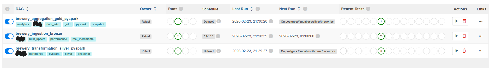
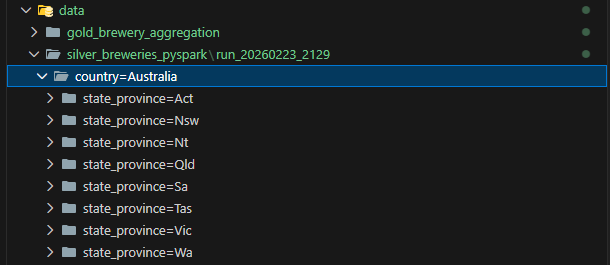

# 🍺 Brewery Data Pipeline (Medallion Architecture)

This project implements a robust and scalable data pipeline that consumes data from the [Open Brewery DB](https://www.openbrewerydb.org/), processes it following the Medallion Architecture (Bronze, Silver, and Gold layers), and stores the final results in Supabase (PostgreSQL).

---

## 🚀 Quick Start Guide

This project is designed to be fully portable via Docker. Follow the steps below to set up the Data Engineering environment on your local machine.

### 1. Prerequisites
Before starting, ensure you have the following installed:
* **Docker Desktop** (with WSL2 support enabled if on Windows).
* **Git** to clone the repository.

### 2. Cloning and Preparation
Open your terminal (PowerShell, Bash, or VS Code terminal) and run:

```bash
# Clone the repository
git clone git@github.com:rfucuhara/brewery-medallion-pipeline.git

# Enter the project folder
cd brewery-medallion-pipeline
```
### 3. Credentials Configuration (Required)
For security reasons, the .env secrets file is not included in the repository. You must create it from the provided template:

1.In the project root, copy the example file:

```bash
    # On Windows (PowerShell) or Linux/Bash:
    cp .env.example .env
```
2.Open the newly created .env file and fill it with your Supabase (PostgreSQL) credentials and your SMTP (Gmail/App Password) to receive failure alerts.

Technical Note: The database connection is automatically injected into Airflow via environment variables, ensuring the pipeline starts pre-configured without requiring manual setup in the UI.

### 4. Environment Initialization
Run the command below to build the images (including Spark and Java 11) and spin up all services:

```bash
docker-compose up -d --build
```

### 5. Accessing the Tools
Once the command finishes and the containers become healthy, the services will be available at the following addresses:

| Service | Address | Credentials |
| :--- | :--- | :--- |
| **Airflow UI** | [http://localhost:8080](http://localhost:8080) | `admin` / `admin` |
| **Data Warehouse** | Supabase (PostgreSQL) | (Defined in your .env) |
| **Logs & Monitoring** | Docker Desktop / Terminal | `docker logs -f airflow_app` |

### 6. Execução do Pipeline
To facilitate demonstration and ensure the environment is configured before processing, the DAGs are loaded in a Paused state. Follow these steps to start the flow:

1. Access the Airflow interface(`localhost:8080`).
2. Activate the switches (toggles) on the left column for the following DAGs:
   * `brewery_ingestion_bronze` (API Extraction)
   * `brewery_transformation_silver_pyspark` (Transformation and Partitioning)
   * `brewery_aggregation_gold_pyspark` (Aggregation and DW Persistence)
3. Trigger the execution manually by clicking the Play (Trigger DAG) icon on the first layer or wait for the scheduled time.

## 🧪 Quality and Testing

Data integrity and pipeline reliability are guaranteed through an automated test suite using **Pytest**. The tests focus on validating transformation logic and the orchestration structure.

### What is being tested?
1. **DAG Integrity Tests**: Verifies that Airflow DAGs are free of syntax errors, directed acyclic graph (DAG) cycles, and have the correct tags and owners configured.
2. **Transform Validation (PySpark)**: Validates that the Silver layer transformation logic (cleaning and casting) maintains the expected data consistency.
3. **Schema Enforcement**: Ensures that the requested partitioning (by `location`) is correctly applied to the Parquet files.

### How to run the tests
Since the environment is fully containerized, you can run the tests without needing to install local dependencies on your host machine:

```bash
docker exec -it airflow_app pytest tests/
```


## 🛠️ Technical Deep Dive & Architecture

The pipeline was engineered following the principles of **Idempotency**, **Observability**, and **Computational Efficiency (Incremental Loading)**. Below are the technical pillars of the implementation:

### 1. Incremental Loading Strategy (Delta Load)
To avoid re-processing historical data and to minimize I/O and compute costs, we implemented a **Checkpointing** logic:
* **Bronze Layer:** We use the `updated_at` field from the Supabase table as a cursor. The DAG identifies the last ingested record and fetches only new or modified data from the API. If no changes are detected, the DAG triggers an `AirflowSkipException`, preventing unnecessary downstream processing.
* **Silver & Gold Layers:** Orchestration is event-driven using **Airflow Datasets**. Transformation tasks only start if the previous layer signals a successful update, ensuring full data consistency across the medallion architecture.

### 2. Observability & Resilience
* **Exponential Backoff Retry:** Configured in `default_args` to handle network instability or API rate limiting. The interval between retries increases exponentially, reducing pressure on the source services.
* **Failure Notifications (SLA):** Implementation of `on_failure_callback`. In the event of a critical error, a structured alert containing direct links to the logs is sent via SMTP to the engineering team.
* **Pre-flight Health Checks:** Before starting heavy processing (Spark), the DAG performs a connectivity check with the Data Warehouse, preventing tasks from hanging in the queue due to credential failures.

### 3. Transformation & Sanitization (Silver Layer)
The Silver layer leverages **PySpark** for distributed processing, applying the following business rules:
* **String Cleaning:** Trimming whitespace, standardizing capitalization (`Initcap`), and removing non-numeric characters from phone fields.
* **Data Cleaning:** Null values in location columns are filled with a `"Not Informed"` placeholder, ensuring that physical partitioning does not fail.
* **Type Casting:** Explicitly casting `latitude` and `longitude` to `Double` to support future geospatial analysis.

### 4. Partitioning & Snapshot Structure
As per the technical requirements, the Silver and Gold layers follow a **High-Performance Data Lake** structure:
* **Execution Isolation (Run-based):** Each execution is isolated in a `run_YYYYMMDD_HHMM` folder. This enables full data lineage (traceability) and facilitates disaster recovery (Rollbacks).
* **Physical Partitioning:** Parquet files are partitioned by `country` and `state_province`.
    * *Benefit:* Analytical queries filtering by region perform **Partition Pruning**, reading only the necessary files. This optimizes query time by up to 10x in large-scale datasets.

### 5. Quarantine & Data Quality (DQ)
The pipeline features safety gates at every stage:
* **API Validation:** Records missing mandatory fields (`id`, `name`, `brewery_type`) are discarded before reaching the Bronze layer.
* **Volumetric Checks:** If the record count in the database diverges from the Spark processed count, the DAG is aborted (`AirflowFailException`), preventing corrupted data from reaching the Gold layer.
* **Smart Upserts:** The use of `execute_values` with `ON CONFLICT DO UPDATE` ensures that duplicate records are updated rather than triggering primary key errors, maintaining a "Single Source of Truth."


## 🖼️ Project Gallery

### 1. Airflow Orchestration
Below is the execution of the Medallion pipeline. All tasks completed successfully, respecting the dependencies between Bronze, Silver, and Gold layers.



### 2. Data Partitioning (Silver Layer)
Visual proof of the PySpark partitioning logic by location (country and state), optimizing data lake storage.



### 3. Gold Layer Results (Supabase)
Final aggregated data ready for consumption in the Data Warehouse.

